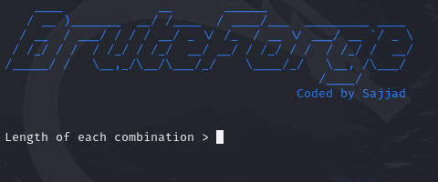

<p align="center">
</p>

# BruteForge

BruteForge is a python-based tool designed for generating brute-force wordlists. It allows users to create combinations of characters based on specified lengths, using predefined character sets or custom character sets.

# Features

* Supports multiple predefined character sets.

* Custom character set support.

* Generates combinations of specified lengths.

* Verbose mode for detailed progress updates.


# Installation

To use BruteForge, ensure you have Python 3 installed on your system.
 
 `git clone https://github.com/Cyber-Anonymous/BruteForge`
 
 `cd BruteForge`
 
 `python3 bruteforge.py -h`
 
 # Usage
 
 ```bash
 
 usage: bruteforge.py [-h] [-l LENGTH] [-c {digits,lowercase,uppercase,special,all}] [-s CUSTOM_CHARSET] [-o OUTPUT] [-v] [--version]

Generate a brute-force wordlist.

options:
  -h, --help            show this help message and exit
  -l LENGTH, --length LENGTH
                        Length of each combination.
  -c {digits,lowercase,uppercase,special,all}, --charset {digits,lowercase,uppercase,special,all}
                        Character set to use: digits, lowercase, uppercase, special, all
  -s CUSTOM_CHARSET, --custom_charset CUSTOM_CHARSET
                        Custom character set to use.
  -o OUTPUT, --output OUTPUT
                        Output file name.
  -v, --verbose         Print progress information.
  --version             show program's version number and exit

 ```
 
## BruteForge
 
 

# Disclaimer

BruteForge is intended for legal and ethical use only. The developers are not responsible for any misuse of this tool. Use it responsibly and only for legitimate purposes.

