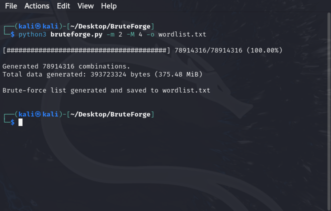
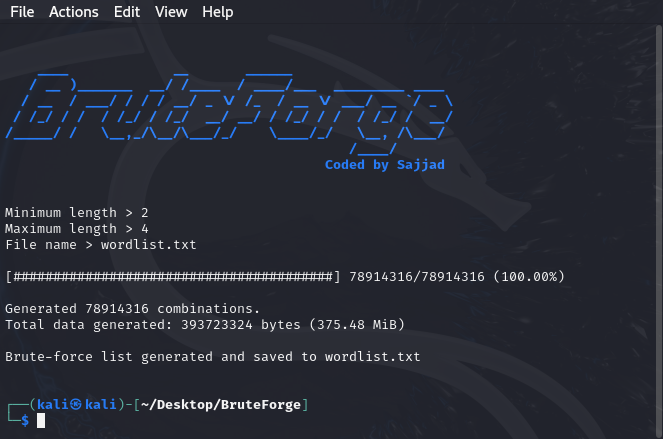

<p>
</p>

# BruteForge

BruteForge is a wordlist generator designed to create comprehensive lists of combinations based on specified criteria. It generates wordlists by combining characters from standard or custom sets according to user-defined lengths.

# Features

* Multiple predefined character sets.

* Supports custom character sets.

* Generates combinations of specified lengths.


* Verbose mode for detailed progress updates.


# Installation

To use BruteForge, ensure you have Python 3 installed on your system.
 
 `git clone https://github.com/Cyber-Anonymous/BruteForge.git`
 
 `cd BruteForge`
 
 `python3 bruteforge.py -h`

 # Usage
 
 ```bash
 
 usage: bruteforge.py [-h] [-m MIN_LENGTH] [-M MAX_LENGTH] [-c {digits,lowercase,uppercase,special,all}]
                     [-s CUSTOM_CHARSET] [-o OUTPUT] [-v] [--version]

Generate a brute-force wordlist.

options:
  -h, --help            show this help message and exit
  -m MIN_LENGTH, --min_length MIN_LENGTH
                        Minimum combination length.
  -M MAX_LENGTH, --max_length MAX_LENGTH
                        Maximum combination length.
  -c {digits,lowercase,uppercase,special,all}, --charset {digits,lowercase,uppercase,special,all}
                        Character set to use.
  -s CUSTOM_CHARSET, --custom_charset CUSTOM_CHARSET
                        Custom character set.
  -o OUTPUT, --output OUTPUT
                        Output file name.
  -v, --verbose         Display progress information.
  --version             show program's version number and exit

 ```

 ## Example
 
 `python3 bruteforge.py -m 2 -M 4 -o wordlist.txt`

 


 ### Interactive Mode

  `python3 bruteforge.py`
 
 
 

# Disclaimer

BruteForge is intended for legal and ethical use only. The developers are not responsible for any misuse of this tool. Use it responsibly and only for legitimate purposes.

